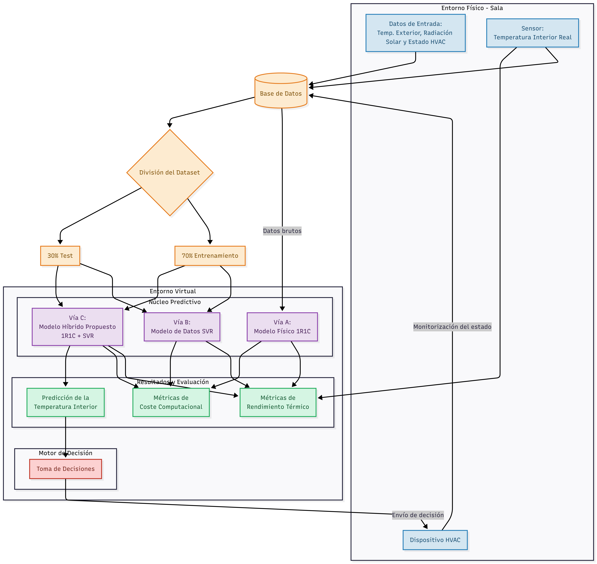
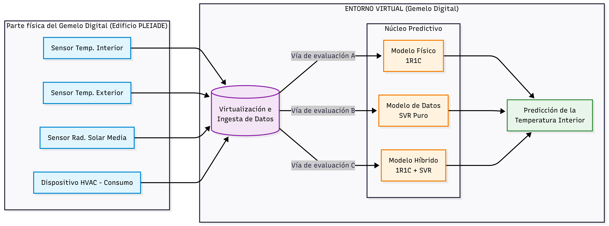

# Núcleo predictivo del Gemelo Digital térmico 
Este repositorio contiene el código implementado en Python durante el Trabajo Fin de Grado con los modelos predictivos creados para el gemelo digital térmico.
Este Trabajo Fin de Grado esta formado por un Gemelo Digital térmico de una sala, el esquema es el siguiente:

Dentro del anterior Gememlo Digital, este trabajo se enfoca en el motor predictivo formado por los 3 distintos modelos predictivos (físico, datos e híbrido). Todos los modelos presentan gráficas y métricas para analizar los resultados y obtener una visión clara de la capacidad de predicción de cada uno, así como los intervalos de prediccón donde estos fallan más.


## Requisitos previos
Para poder ejecutar los distintos modelos es neceario lo siguiente:
* Instalar Pyhton: la versión de Python instalada durante el desarrollo es Python 3.12.3
* Guardar el dataset data-roomA-10T.csv dentro de los directorios de los modelos: el Dataset se puede descargar desde el repositorio Zenodo en la dirección https://zenodo.org/records/7620136. Es neceario descargarlo en las capetas donde se alojen los modelos predictivos.
* Instalar dependencias: se ha generado un txt con nombre requirements.txt para la instalación de dependencias. Para su instalación hay que ejecutar el comando "pip install -r requirements.txt" dentro del directorio donde se encuentra el txt.
## Descripción de los ficheros
Dentro del reposiorio se encuentar 3 ficheros que contienen los distintos scripts con los modelos. Se ha crado una enumeración los directorios y sus respectivos scripts de Python.
* config.json: json con la configuración necesaria para el uso de los modelos con distitnos dataset. Conservar el existente en el repositorio si no se quiere modificar el dataset.
* RC: contiene el código del modelo 1R1C
    * RC/fisico.py: código del modelo físico que predice la temperatura interior de la sala a lo largo de un año.
* ML: contiene el código del modelo de datos SVR
    * ML/datos.py: código del modelo de datos que predicice la temperatura interior de la sala, simulando el escenario donde se recogen una serie de datos desde el principio del año y se predice al final, sin conocer la temperatura interior en esos momentos.
    * ML/datos-genX.py: código del modelo de datos que evalua la generalización, entrenando en épcoas distintad del año para ver como responde ante datos nunca vistos previamente.
* Híbrido: contiene el código del modelo híbrido 1R1C + SVR para aprender el error residual.
    * Hibrido/hibirdo.py: código del modelo híbrido que predice la temperatura a partir del modelo físico y apredne el error residual con un algoritmo SVR. Se prueba la predicción igual que en el modelo de datos, entrenando el modelo en los primeros meses consecutivos y probándolo en los últimos.
    * Hibrido/hibrido-genX.py: código del modelo híbrido que evalua la generalización, al igual que en el modelo de datos, se entrena y prueba en distinas épocas del año para comrobar si el error es aprendido.
Las X correspondiente a los ficheros que evaluan la generalización tienen el siguiente signfiicado:
* X = 1: entrenamiento del modelo en verano y test en invierno
* X = 2: entrenamiento del modelo en primavera y test en otoño
  
Todos los modelos tiene el mismo porcentaje en la división del dataset, siendo un 70/30 para entrenamiento y test, respectivamente.
## Ejecución
Para su ejecución, una vez realizaos los requisitos previos, basta con ejecutar el comando
```bash
python3 <directorio_script>/<nombre_script>.py <archivo_configuración>
```
Una vez ejecutado el script, apareceran 2 gráficas:
* Gráfica 1: muestra la diferencia entre la temperatura simulada y la real
* Gráfica 2: muestra el error durante la simulación en la predicción de la temperatuara.

Adicionalmente, apareceran en el terminal donde se ejecutó el script los resultados de las métricas, tanto de rendimiento como de coste computacional.